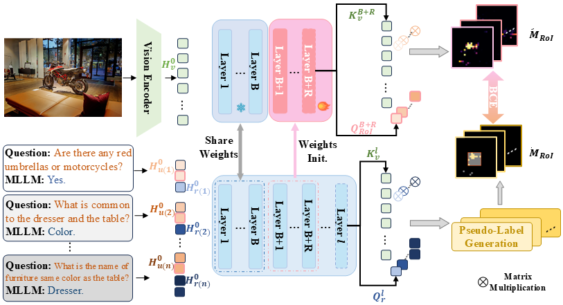
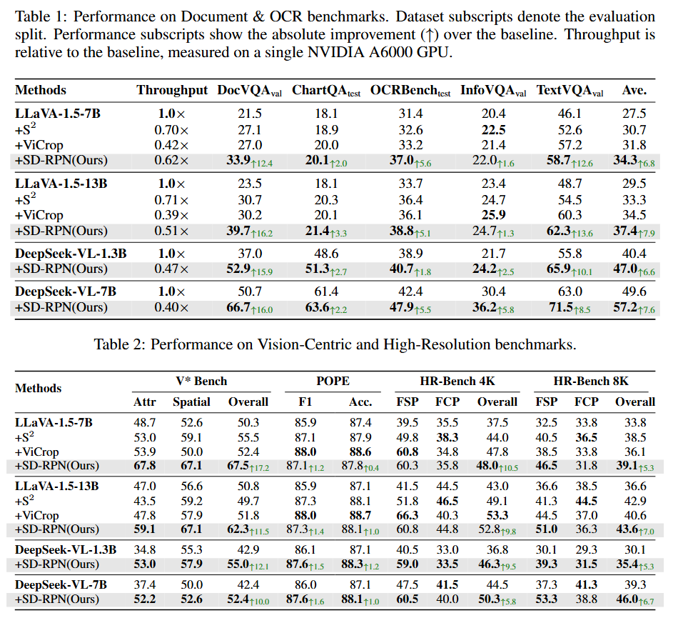

<div align="center">
<h1>SD-RPN </h1>
<h3>Catching the Details: Self-Distilled RoI Predictors for Fine-Grained MLLM Perception</h3>

Paper: ([arXiv:2407.18559](https://arxiv.org/abs/2407.18559))
</div>


## Updates
* **`Sep. 17th, 2025`**: We release the code, data and ckpt for SD-RPN.

### TODO
- [x] Release code and weights for DeepSeek-VL

## Introduction
While recent methods leverage a Region-of-Interest (RoI) mechanism to focus on salient areas, they typically present a difficult trade-off: training-based approaches depend on large-scale annotated datasets, while training-free methods that utilize the model's internal attention are computationally inefficient, requiring either multi-pass prefill stages or reliance on the slow auto-regressive decoding process for RoI identification.
We propose an efficient, annotation-free **S**elf-**D**istilled **R**egion **P**roposal **N**etwork (SD-RPN) that resolves this trade-off. Our core innovation is a pipeline that processes and denoises the noisy cross-attention maps from the MLLM's middle layers to generate pseudo-RoI labels. We then use these labels to train a lightweight and tunable Region Proposal Network (RPN) that is built upon the frozen MLLM backbone. Our RPN predicts the RoI in a single forward pass using features available from the MLLM's middle layers, completely decoupling RoI identification from the auto-regressive generation process and avoiding costly multi-pass operations.
<p align="center">
  
</p>


## Main Results

<p align="center">
  
</p>


# Getting Started with SD-RPN
We provide the code and instructions to train and evaluate SD-RPN based on LLaVA. Please follow the instructions below.
1. Clone this repository and navigate to LLaVA folder
```bash
git clone https://github.com/YuHengsss/SD-RPN.git
cd LLaVA
```

2. Install Package
```Shell
conda create -n llava_roi python=3.10 -y
conda activate llava
pip install --upgrade pip  # enable PEP 660 support
pip install -e .
```

3. Install additional packages for training cases
```
pip install -e ".[train]"
pip install flash-attn==2.1.1 --no-build-isolation
```

Note: we provide some issue fixes during installation and training in `issue_fix`.

## Training

To train SD-RPN upon LLaVA, please follow the instructions below:
1. Download the pkl [annotation](https://huggingface.co/YuhengSSS/roi_pseudo) and **move** it in your `dataset` folder.
```
# export HF_ENDPOINT=https://hf-mirror.com # for China users
huggingface-cli download YuhengSSS/roi_pseudo --local-dir ./
```
2. Download the `GQA` and `OCR-VQA` in your `dataset` folder. We provide the download script in `scripts/download_datasets.sh`. Change the `DATAPATH` and `CODEPATH`  in the script to your own folder.


3. **Start training!** Note that before training, you need to configure the `miniconda3 path`, `HUGGINGFACE_HUB_CACHE` and `DATASET_PATH` in the scripts under `scripts/finetune_rois.sh` and `scripts/finetune_rois_13b.sh` to your own path. It takes less than 4 hours to train SD-RPN+7B on 4 A6000 GPUs.

```
# for 7B
bash scripts/finetune_rois.sh

# for 13B
bash scripts/finetune_rois_13b.sh
```

4. Merge the checkpoint with the original LLaVA weights to obtain the final model.
```
python migrate_weights.py #change FINETUNED_MODEL_PATH, ORIGINAL_MODEL_PATH and DSTINATION_MODEL_PATH to your own path
```

5. (Optional) If you wish to train RPN using LLaVA's SFT response:
```
huggingface-cli download liuhaotian/LLaVA-Instruct-150K --repo-type dataset \
  --include "llava_v1_5_mix665k.json" --local-dir ./ #replace with your own path

#get subset for RPN training
python make_152k_samples.py #change the path to your own path

bash scripts/finetune_rois_sft_label.sh #change the path to your own path
```

## Inference
We utilize lmms-eval to evaluate the model. Please follow the instructions below:

0. Download the pretrained model and move it to your `checkpoints` folder if you want to evaluate our pretrained model.
```
# export HF_ENDPOINT=https://hf-mirror.com # for China users
#7B
huggingface-cli download YuhengSSS/llava-v1.5-7b-roi-K15T3-152k-v1bf16Mheads-twiginit-filled --repo-type model --local-dir ./

#13B, need to run migrate_weights to merge weights, it is not the complete model.
huggingface-cli download YuhengSSS/llava-v1.5-13b-roi-K15T3-152k-v1bf16Mheads-twiginit --local-dir ./  --repo-type model
```

1. Install lmms-eval, check the script in `lmms-eval/README.md`.


2. Run the evaluation script in `lmms-eval`. Change the `checkpoint_path` to your own path.
```
bash lmms-eval/examples/A6000/reproduce.sh
```

## Make pseudo labels
1. Generate pseudo labels for OCR-VQA and GQA datasets
```
python make_pseudo_label.py #change the path to your own path
python make_pseudo_label2.py #change the path to your own path
```

2. Merge the pseudo labels
```
python merge_pkls.py #change the path to your own path
```

Then you will get the pseudo label like `llava_v1_5_7b_pseudo_roi_release.pkl` and `llava_v1_5_13b_pseudo_roi_release.pkl`.

## Citation
If you find SD-RPN useful in your research, please consider citing the following paper:
```
```

## Acknowledgement
This project is based on [LLaVA](https://github.com/haotian-liu/LLaVA), [lmms-eval](https://github.com/EvolvingLMMs-Lab/lmms-eval) and [DeepSeek-VL](https://github.com/deepseek-ai/DeepSeek-VL). We sincerely thank the authors for their great work and open-sourcing the code.